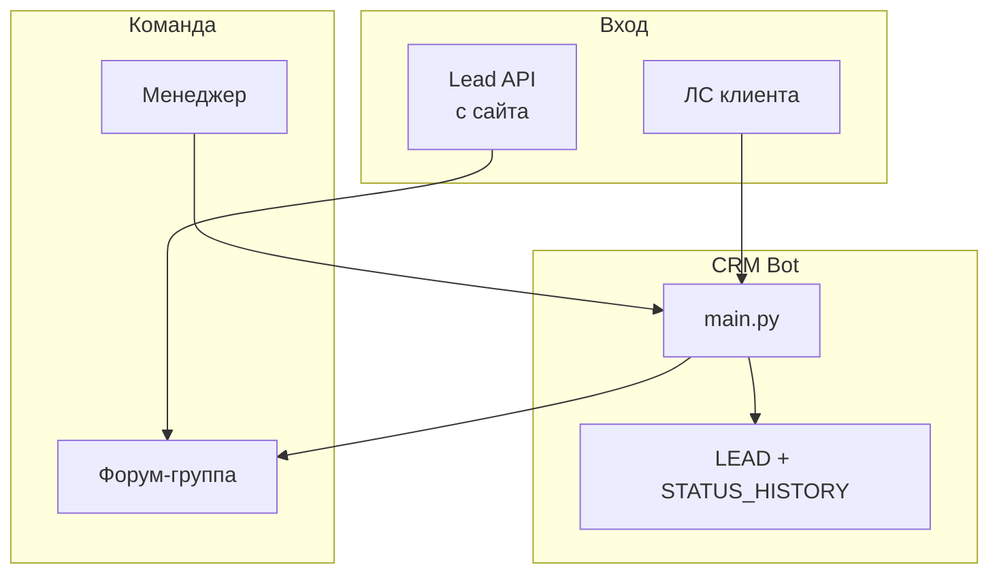
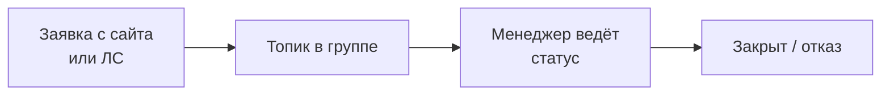
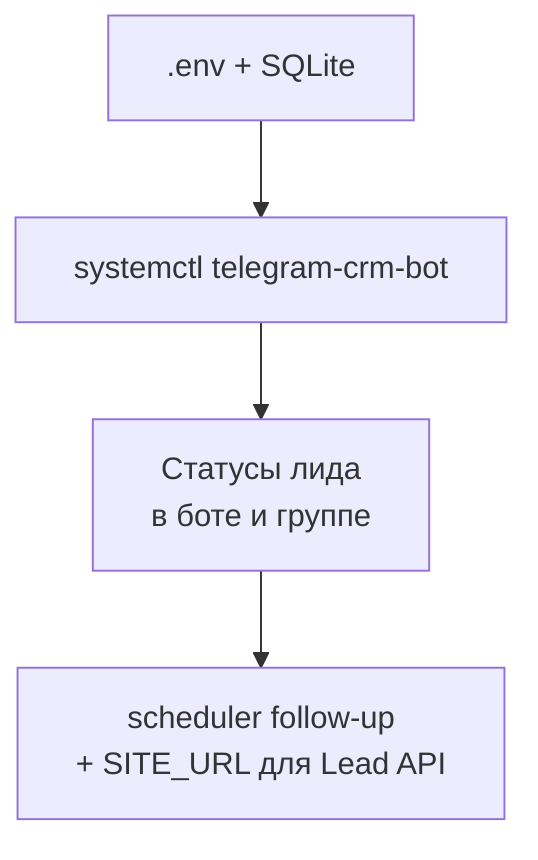

# Telegram CRM Bot

Короче: **лид в ЛС → форум-топик в группе → статусы и тарифы**, связка с Lead API с сайта.

Задача: менеджеры живут в Telegram, не в отдельной CRM-системе. Заявка с сайта падает в ту же группу — воронка не рвётся.

---

## Что сделано

- **Карточка лида** в чате — имя, телефон, статус, источник.
- **Форум-топики** — один клиент = один тред.
- **Админ-панель** — тарифы, рассылки, модерация.
- **Scheduler** — истечение событий, фоновые job.
- **Интеграция Lead API** — POST с сайта → сообщение в GROUP_ID.

---

## Фишки и удобство

| Фишка | Зачем |
|-------|-------|
| FSM многошаговых форм | Сбор данных без веб-формы |
| STATUS_HISTORY | Воронка не в голове менеджера |
| Шаблоны ответов | Быстрые кнопки |
| SQLite / SQLAlchemy | Лёгкий деплой без отдельной БД-сервера |
| Один GROUP_ID с API | Сайт и бот в одном потоке |

---

## Схема данных



---

## Процесс пользователя



**Администратор / менеджер:**



---

## Стек

| Слой | Технология |
|------|------------|
| Бот | aiogram |
| БД | SQLite / SQLAlchemy |
| Фон | scheduler.py |
| Сайт | site-lead-api |

---

## Структура репозитория

```
README.md
LICENSE
.gitignore
bot/                      — main, db, admin, scheduler
docs/                     — DIAGRAMS.md (3× mermaid)
examples/.env.example
requirements.txt
```

---

## Быстрый старт

```bash
cp .env.example .env
# BOT_TOKEN, GROUP_ID, ADMIN_IDS, SITE_URL
systemctl restart telegram_crm_bot
```
